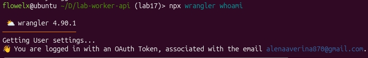
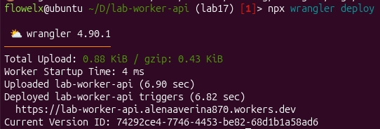
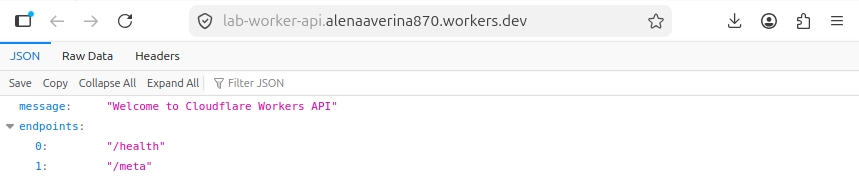
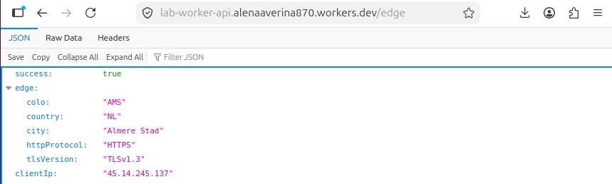
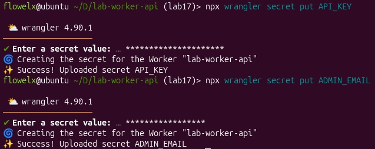

# Lab 17 — Cloudflare Workers Edge Deployment

## Deployment Summary

**Worker URL:** `https://lab-worker-api.alenaaverina870.workers.dev`

**Main Routes:** `/`, `/health`, `/meta`, `/edge`, `/kv/save`, `/kv/get`, `/admin/status`

**Configuration:** TypeScript, KV namespace `LAB_KV`, environment variables + secrets

---

## Evidence

**Created application:**

**Successful account verification:**

**Successful deployment:**

**`/` endpoint:**

**`/edge` endpoint:**

**Secrets creation:**

---

### Kubernetes vs Cloudflare Workers

| Aspect | Kubernetes | Cloudflare Workers |
|--------|------------|---------------------|
| Setup complexity | High | Low |
| Deployment speed | 30-60 seconds | ~10 seconds |
| Global distribution | Manual | Automatic |
| Cost (small apps) | $10-50+/month | Free tier (100k req/day) |
| State model | PersistentVolumes, databases | KV, D1, R2 |
| Control | Full | Limited |
| Best use case | Complex microservices, ML | Edge APIs, auth, optimization |

---

### When to Use Each

| Scenario | Choice |
|----------|--------|
| Complex microservices, stateful apps, ML inference | **Kubernetes** |
| Global API gateway, JWT validation, A/B testing | **Workers** |
| Hybrid approach | Workers as edge gateway in front of Kubernetes |

---

### Reflection

**Easier than Kubernetes:**
- No infrastructure management
- One-command global deployment
- Built-in metrics and logs
- Fast cold starts (~5ms)

**Constrained vs Kubernetes:**
- No filesystem writes
- Execution time limits (30s max, 10ms CPU on free tier)
- No custom binaries
- KV eventual consistency

**Because Workers is not a Docker host:**
- No background daemons
- Stateless by default
- No Dockerfile needed
- JavaScript/WASM only (no system dependencies)