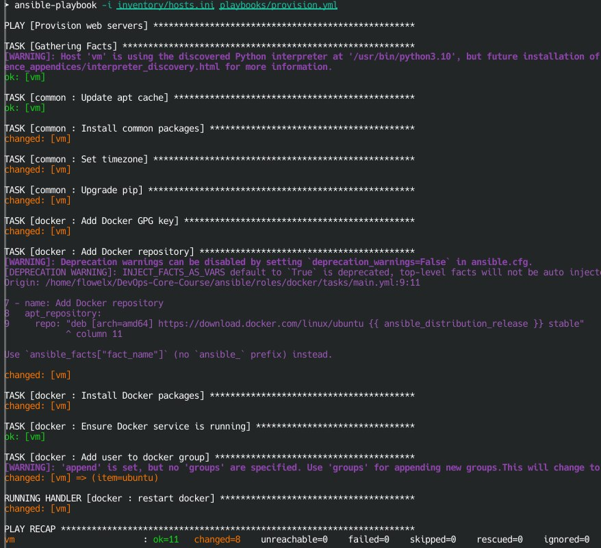
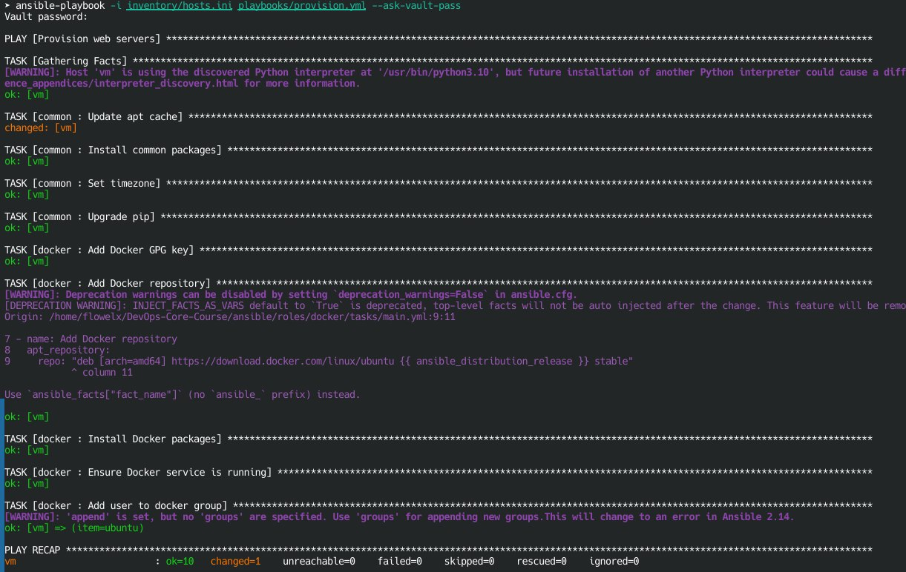
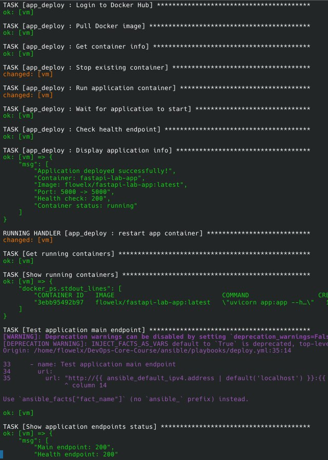
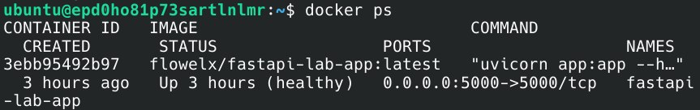

# Lab 5 — Ansible Fundamentals

## 1. Architecture Overview

### Ansible version used

```bash
ansible --version
ansible [core 2.20.1]
```

### Target VM OS and version

**Ubuntu 22.04 LTS**

### Role structure explanation

1. `common` role configures base system for server
2. `docker` role installs and configures Docker 
3. `app_deploy` role deploys the actual application 

`common` role -> `docker` role -> `app_deploy` role

### Why roles instead of monolithic playbooks?

Using roles instead of monolithic playbooks ensures better readability as this provides clear separation of concerns and it's easier to debug and update isolated components. 

## 2. Roles Documentation

### `common` role:

**Purpose:** Configures base system for server
**Variables:** Common packages and timezone
**Handlers:** No handlers
**Dependencies:** No dependencies

### `docker` role:

**Purpose:** Installs and configures Docker
**Variables:** Dokcer version, Docker Compose version, Docker users, Docker repository URL, Docker GPG key URL
**Handlers:** Docker restart
**Dependencies:** Depends on `common` role

### `deploy` role:

**Purpose:** Deploys the actual application
**Variables:** Application settings, Docker settings, environment variables, health check and vault variables
**Handlers:** App container restart and reload
**Dependencies:** Depends on `docker` role

## 3. Idempotency Demonstration

### Terminal output from FIRST provision.yml run



### Terminal output from SECOND provision.yml run



### Analysis: What changed first time? What didn't change second time?

Most of the tasks were changed first time. Packets, Docker, container weren't on the server. Then second time only 1 task was changed because I set `cache_valid_time: 3600` for cache update. Ansible checks system state and doesn't do unnecessary actions. If everything is set properly, nothing changes.

### Explanation: What makes your roles idempotent?

I used `state: present' that ensures packages are intalled. 

## 4. Ansible Vault Usage

### How you store credentials securely

I use **Ansible Vault** to encrypt sensitive data.

### Vault password management strategy

```bash
ansible-playbook playbooks/deploy.yml --ask-vault-pass
```

### Example of encrypted file (show it's encrypted!)


### Why Ansible Vault is important

Ansible Vault is important because passwords are encrypted and it's safe in case of pushing file to git.

## 5. Deployment Verification

### Terminal output from deploy.yml run



### Container status: docker ps output



### Health check verification: curl outputs

```bash
curl http://62.84.120.249:5000/health | jq
{
  "status": "healthy",
  "timestamp": "2026-02-26T20:42:46.002Z",
  "uptime_seconds": 10337
}
```

## 6. Key Decisions

### Why use roles instead of plain playbooks?

- **Organization** - Roles group related tasks, variables, and handlers together
- **Readability** - Playbooks become clean and simple (just list roles)
- **Reusability** - Same role can be used in multiple playbooks
- **Maintainability** - Easier to update and debug isolated components

### How do roles improve reusability?

- **Parameterization** - Variables make roles adaptable to different environments
- **Encapsulation** - All dependencies are contained within the role
- **Sharing** - Roles can be shared via Ansible Galaxy
- **Composability** - Mix and match roles for different server types

### What makes a task idempotent?

- **State checking** - Modules check current state before making changes
- **Declarative syntax** - Describe the desired state, not how to achieve it
- **Conditionals** - Tasks run only when needed (e.g., when: container_info.exists)
- **No "latest"** - Using state: present instead of state: latest
- **Idempotent modules** - Ansible modules are designed to be idempotent

### How do handlers improve efficiency?

- **Run-once** - Execute only once, even if notified by multiple tasks
- **Conditional execution** - Run only when changes actually occur
- **Order control** - Execute at the end of the play, not during
- **Resource savings** - Prevent unnecessary restarts (e.g., restart Docker once, not multiple times)

### Why is Ansible Vault necessary?

- **Security** - Encrypts sensitive data (passwords, tokens, keys)
- **Version control safe** - Can commit encrypted files to git
- **Compliance** - Meets security standards and audit requirements
- **Team collaboration** - Share code without sharing secrets
- **Multi-environment** - Different passwords for dev/staging/production
