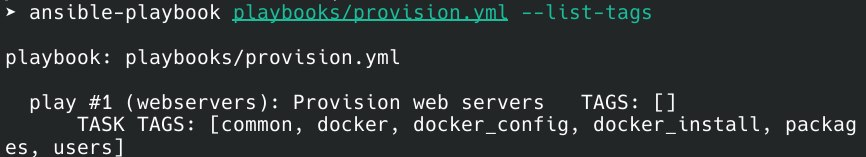
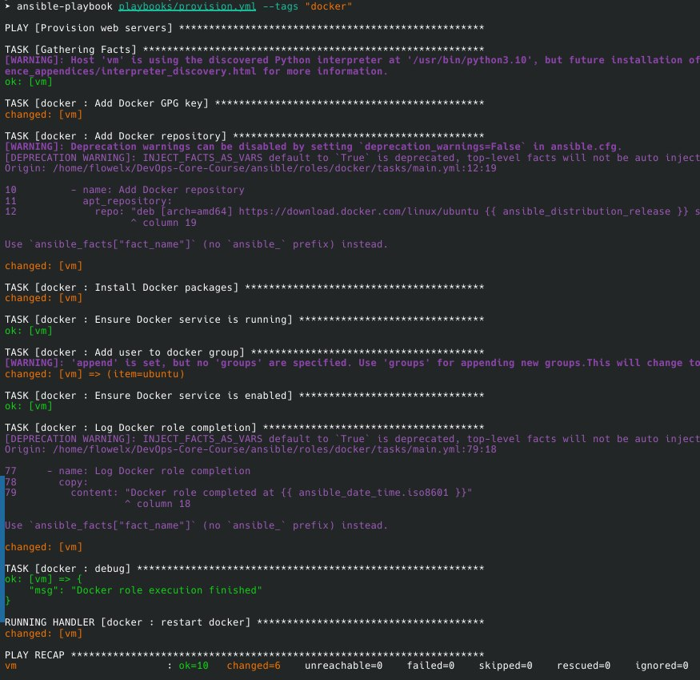
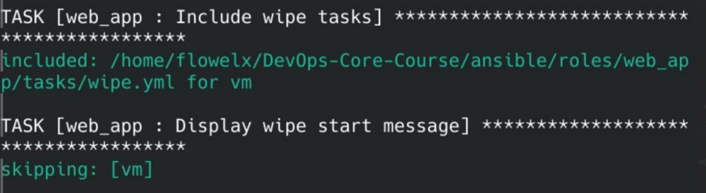
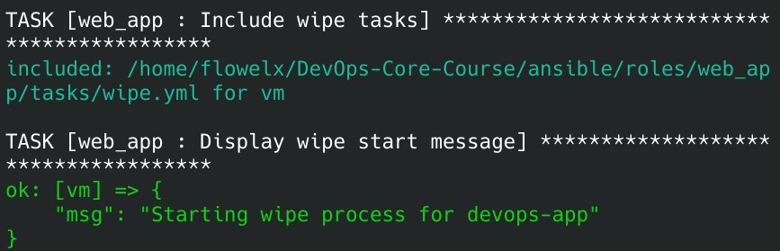

# Lab 6 — Advanced Ansible & CI/CD

## 1. Overview

This project automates application deployment using Ansible and GitHub Actions. I took a basic Ansible setup and added proper structure, safety features, and CI/CD automation.

What I Used:

- Ansible for automation
- Docker Compose for containers
- GitHub Actions for CI/CD
- Ubuntu servers for deployment

## 2. Blocks & Tags

I organized each role using blocks to group related tasks:

Common Role - Groups package tasks and user tasks separately
Docker Role - Separates installation from configuration

Tag Strategy:

- packages - Just install packages
- users - Just manage users
- docker_install - Only Docker installation
- docker_config - Only Docker setup
- web_app_wipe - Only cleanup operations

Example Usage:
```bash
ansible-playbook deploy.yml --tags docker_install

ansible-playbook deploy.yml --skip-tags common

ansible-playbook deploy.yml --list-tags
```





## 3. Docker Compose Migration

I replaced the old docker run approach with Docker Compose templates.

Before: Manual container management with multiple tasks
After: Single declarative docker-compose.yml template

The template supports:

- Dynamic service names and ports
- Environment variables (including vault secrets)
- Health checks
- Restart policies

I also added proper role dependencies - the web_app role now automatically pulls in the docker role, so Docker is always installed first.

## 4. Wipe Logic

This was tricky - needed a way to completely remove the app, but make it really hard to do by accident.

The Solution: Double safety - requires BOTH a variable AND a tag:

```yaml
web_app_wipe: false

when: web_app_wipe | bool
tags: web_app_wipe
```

Test Scenarios:

- Normal deploy - wipe skipped (safe)
- Wipe only - -e "web_app_wipe=true" --tags web_app_wipe removes everything
- Clean reinstall - -e "web_app_wipe=true" wipes then deploys fresh
- Safety check - tag without variable = nothing happens

The wipe task removes containers, compose file, and app directory. Optional image/volume cleanup too.





## 5. CI/CD Pipeline

GitHub Actions automates everything on git push:

Workflow Steps:

- Lint - Runs ansible-lint to catch syntax errors
- Deploy - Sets up SSH, decrypts vault, runs playbook
- Verify - Checks health endpoint, confirms container is running

## 6. What I Learned

Blocks are great for:

-Grouping related tasks
- Applying conditions once
- Error handling with rescue/always

Tag + Variable combo is perfect for dangerous operations like wipe - prevents accidents but still allows automation.

Idempotency matters - Second run of the playbook shows "ok" not "changed". Docker Compose handles this automatically.

CI/CD secrets need careful handling - I create temp files and immediately delete them, even on failure.

## 7. Research Answers

Q: Rescue block failure?

A: Always block still runs, but playbook stops for that host.

Q: Nested blocks?

A: Yes, used them for package groups inside roles.

Q: Tag inheritance?

A: Tasks inherit parent block tags, can add their own.

Q: Variable + tag why both?

A: Double safety - tag for selective execution, variable for default-off behavior.

Q: Self-hosted vs GitHub runner?

A: Self-hosted is more secure (no SSH keys in GitHub), faster (same network), but needs maintenance.
