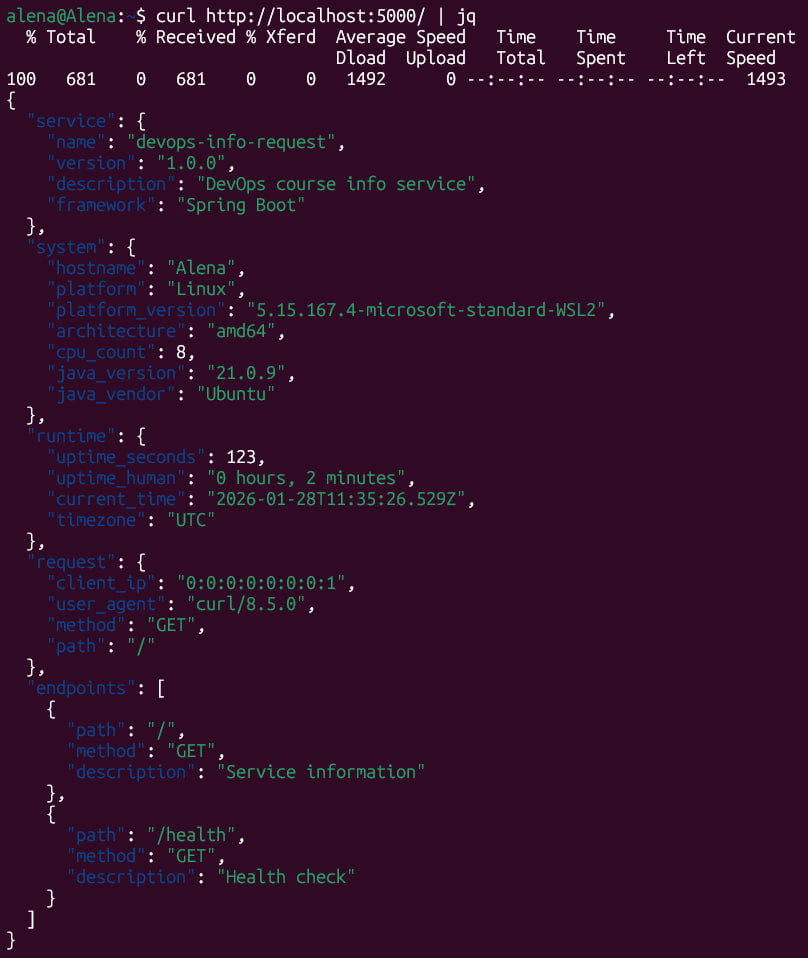
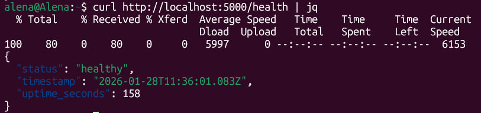

# LAB01 – DevOps Info Service (Java / Spring Boot)

## 1. Overview

This Java service implements a DevOps info API using Spring Boot framework. It provides system information, service metadata, and health check endpoints in a structured JSON format. The service exposes `GET /` for comprehensive service information and `GET /health` for health monitoring.

## 2. Architecture

- **Spring Boot Application**: Built with Spring Boot using minimal configuration and auto-configuration
- **Single Controller Design**: All endpoints are implemented in `MainApplication.java` as a combined `@SpringBootApplication` and `@RestController`
- **Layered Logic**:
    - Controller layer handles HTTP requests and responses
    - Business logic methods encapsulate system information gathering and uptime calculation
    - Exception handling with centralized error responses
- **Request Context Integration**: Uses `HttpServletRequest` to extract client information including IP address and user agent

## 3. Configuration & Environment

- **No External Configuration**: The service uses default Spring Boot configurations
- **Default Port**: Runs on port 8080
- **Environment Variables**:
    - Can be configured via standard Spring Boot properties
    - `SERVER_PORT` – override HTTP port (e.g., `SERVER_PORT=9090`)
    - `SERVER_ADDRESS` – bind address (e.g., `SERVER_ADDRESS=0.0.0.0`)
- **Logging**: Uses SLF4J with Logback for structured logging

## 4. Build & Run

### Prerequisites

- Java 21
- Maven 3.6
- Spring Boot 4.0.2

### Build and Run Commands

```bash
cd app_java
mvn install
java -jar ./target/*.jar
```

## 5. API Endpoints Structure

### `GET /` - Service Information

Returns comprehensive service and system information:

- **service**: Name, version, description, framework
- **system**: Hostname, OS details, CPU count, Java version
- **runtime**: Uptime (seconds and human-readable), current UTC time
- **request**: Client IP, user agent, HTTP method, path
- **endpoints**: Available API endpoints with descriptions

### `GET /health` - Health Check

Returns service health status:

- **status**: "healthy" service status
- **timestamp**: Current UTC timestamp
- **uptime_seconds**: Service uptime in seconds

## 6. Testing Evidence

### Manual Verification Commands

**Request:**

```bash
curl http://localhost:5000/
```

**Response:**



**Request:**

```bash
curl http://localhost:5000/health
```

**Response:**



### Terminal Output

```
2026-01-28 14:33:24 - d.d.d.MainApplication - INFO - Starting MainApplication v0.0.1-SNAPSHOT using Java 21.0.9 with PID 1181 (/mnt/c/Users/a11al/DevOps-Core-Course/app_java/target/devops-info-service-0.0.1-SNAPSHOT.jar started by alena in /mnt/c/Users/a11al/DevOps-Core-Course/app_java)
2026-01-28 14:33:24 - d.d.d.MainApplication - INFO - No active profile set, falling back to 1 default profile: "default"
2026-01-28 14:33:31 - o.s.boot.tomcat.TomcatWebServer - INFO - Tomcat initialized with port 5000 (http)
2026-01-28 14:33:31 - o.a.catalina.core.StandardService - INFO - Starting service [Tomcat]
2026-01-28 14:33:31 - o.a.catalina.core.StandardEngine - INFO - Starting Servlet engine: [Apache Tomcat/11.0.15]
2026-01-28 14:33:31 - o.s.b.w.c.s.WebApplicationContextInitializer - INFO - Root WebApplicationContext: initialization completed in 6375 ms
2026-01-28 14:33:32 - o.s.b.a.e.web.EndpointLinksResolver - INFO - Exposing 2 endpoints beneath base path '/actuator'
2026-01-28 14:33:33 - o.s.boot.tomcat.TomcatWebServer - INFO - Tomcat started on port 5000 (http) with context path '/'
2026-01-28 14:33:33 - d.d.d.MainApplication - INFO - Started MainApplication in 9.527 seconds (process running for 7.858)
2026-01-28 14:33:33 - d.d.d.MainApplication - INFO - Server started successfully
2026-01-28 14:35:26 - o.a.c.c.C.[Tomcat].[localhost].[/] - INFO - Initializing Spring DispatcherServlet 'dispatcherServlet'
2026-01-28 14:35:26 - o.s.web.servlet.DispatcherServlet - INFO - Initializing Servlet 'dispatcherServlet'
2026-01-28 14:35:26 - o.s.web.servlet.DispatcherServlet - INFO - Completed initialization in 1 ms
2026-01-28 14:35:26 - d.d.d.MainApplication - INFO - GET / from 0:0:0:0:0:0:0:1
2026-01-28 14:36:01 - d.d.d.MainApplication - INFO - Health check requested
```

