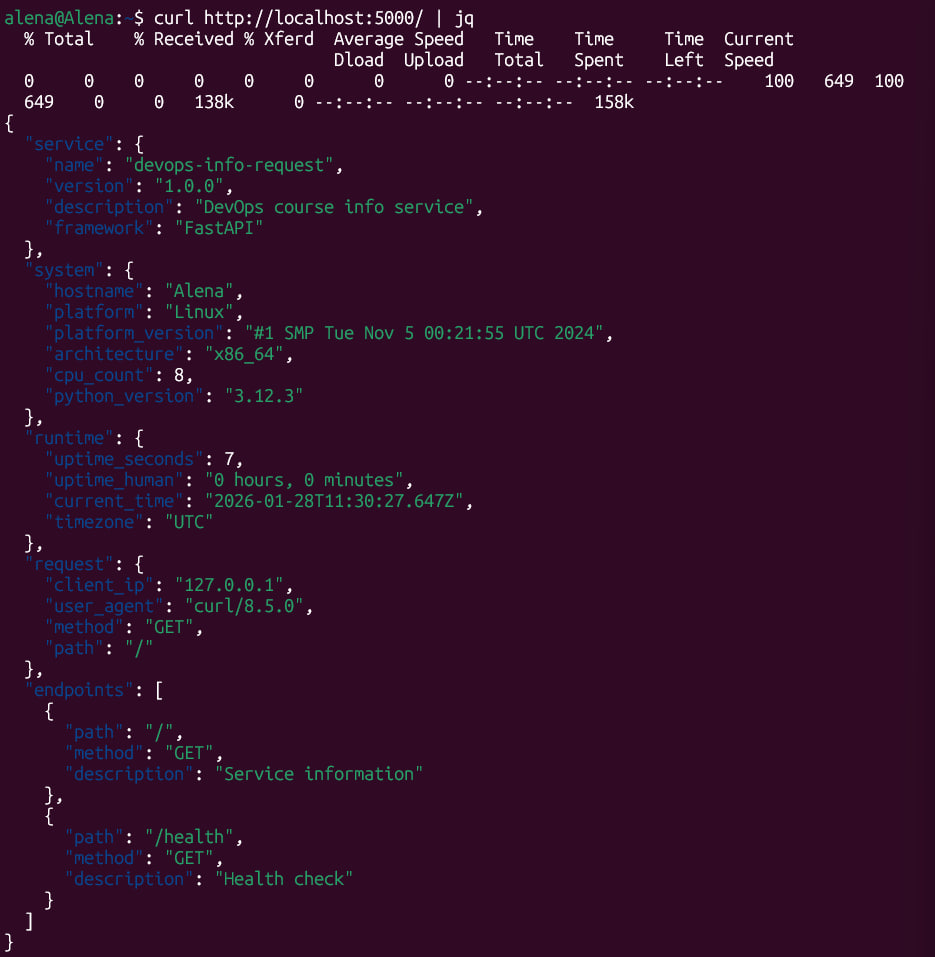
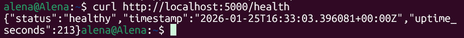

# Lab 1 — DevOps Info Service: Web Application Development

## 1. Framework Selection

**Selected Framework: FastAPI**

My framework choice was FastAPI. I have previous experience with the framework in academic projects. It provides an automatic API documentation (via Swagger UI) and has excellent asynchronous performance.

**Comparison table:**

| **Feature**       | **FastAPI**    | **Flask**  | **Django**    |
| ----------------- | -------------- | ---------- | ------------- |
| **Performance**   | Async          | Sync       | Sync          |
| **Documentation** | Auto-generated | Manual     | Manual        |
| **Complexity**    | Moderate       | Easy       | Difficult     |
| **Best For**      | APIs           | Small apps | Full web apps |

## 2. Best Practices Applied

#### 1. Clean code organization

**Clear function names** allow developers to quickly understand a function's purpose.

```python
def get_uptime():
async def ger_service_info(request: Request):
async def health_check():
```

**Proper imports grouping** enhances code's readability. Standard library imports come first, followed by third-party imports.

```python
import os
import socket
import platform
import logging
from datetime import datetime, timezone

from fastapi import FastAPI, Request
from fastapi.responses import JSONResponse
import uvicorn
```

**Comments only where needed** help developers quickly get familiar with code. An abundance of comments decreases readability. 

```python
async def health_check():
    """
    Health check endpoint for service monitoring.
    Returns:
        dict: Service health status with timestamp and uptime.
    """
    
def not_found_exception_handler(request: Request, exc: Exception):
    """Handle 404 errors: page not found"""
```

**Follow PEP 8**

- Proper import grouping
- 4-space indentation
- Line length < 79 characters 
- Descriptive variable names

```python
return {
        'seconds': seconds,
        'human': f"{hours} hour{'s' if hours != 1 else ''}, "
                 f"{minutes} minute{'s' if minutes != 1 else ''}"
    }
```

#### 2. Error Handling

Error handling is cruicial in the creation and maintenance of web applications because developers should cover all possible outcomes so that end users won't face unexpected behavior.

```python
@app.exception_handler(500)
async def internal_error_handler(request: Request, exc: Exception):
    """Handle 500 errors: internal server errors"""

    return JSONResponse(
        status_code=500,
        content={
            'error': 'Internal Server Error',
            'message': 'An unexpected error occurred'
        }
    )
```

#### 3. Logging

Logging is a significant part of the development process that ensures competent debugging.

```python
logger.info(f'Starting server on {HOST}:{PORT}')

logger.info('Health check requested')
```

#### 4. Dependencies

The `requirements.txt` file lists the required versions of packages ensuring consistent environments in develompent, testing, and production.

```
fastapi==0.115.0
uvicorn[standard]==0.32.0
```

#### 5. Git Ignore

The `.gitignore` file is used to avoid leaking of files with sensitive information and files with large amounts of unnecessary data and cache from Git tracking. 

```
# Python
__pycache__/
*.py[cod]
venv/
*.log

# IDE
.vscode/
.idea/

# OS
.DS_Store
```

## 3. API Documentation

#### GET / - Service Information

**Request:**

```bash
curl http://localhost:5000/ | jq
```

**Response:**

```
{
  "service": {
    "name": "devops-info-request",
    "version": "1.0.0",
    "description": "DevOps course info service",
    "framework": "FastAPI"
  },
  "system": {
    "hostname": "Alena",
    "platform": "Linux",
    "platform_version": "#1 SMP Tue Nov 5 00:21:55 UTC 2024",
    "architecture": "x86_64",
    "cpu_count": 8,
    "python_version": "3.12.3"
  },
  "runtime": {
    "uptime_seconds": 7,
    "uptime_human": "0 hours, 0 minutes",
    "current_time": "2026-01-28T11:30:27.647Z",
    "timezone": "UTC"
  },
  "request": {
    "client_ip": "127.0.0.1",
    "user_agent": "curl/8.5.0",
    "method": "GET",
    "path": "/"
  },
  "endpoints": [
    {
      "path": "/",
      "method": "GET",
      "description": "Service information"
    },
    {
      "path": "/health",
      "method": "GET",
      "description": "Health check"
    }
  ]
}
```

#### GET /health - Health Check

**Request:**

```bash
curl http://localhost:5000/health | jq
```

**Response:**

```
{
  "status": "healthy",
  "timestamp": "2026-01-28T11:31:27.003Z",
  "uptime_seconds": 67
}
```

## 4. Testing Evidence

#### Screenshots

**1. Main Endpoint (`GET` /)**



**2. Health Check (`GET` /health)**



#### Terminal Output

```
2026-01-28 14:30:19,373 - __main__ - INFO - Starting server on 0.0.0.0:5000
INFO:     Started server process [1126]
INFO:     Waiting for application startup.
INFO:     Application startup complete.
INFO:     Uvicorn running on http://0.0.0.0:5000 (Press CTRL+C to quit)
2026-01-28 14:30:27,646 - app - INFO - GET / from 127.0.0.1
INFO:     127.0.0.1:37898 - "GET / HTTP/1.1" 200 OK
2026-01-28 14:31:27,003 - app - INFO - Health check requested
INFO:     127.0.0.1:45926 - "GET /health HTTP/1.1" 200 OK

```

## 5. Challenges & Solutions

**Challenge 1: First Independent API Development**

Previously I only assisted with creating endpoints. I had never built a complete web service from scratch, so my practical experience with FastAPI was limited. 

**Solution:** Studied FastAPI documentation.

**Challenge 2: Understanding Application Architecture**

I was unfamiliar with the relationship between FastAPI and ASGI servers.

**Solution:** Learned that uvicorn is the ASGI server. FastAPI defines the application logic. Uvicorn serves it to handle HTTP requests. 

---
## GitHub Community

Starring repositories signals interest and support, helping projects gain visibility and recognition within the developer community. Following developers provides learning opportunities through their code contributions and fosters networking for potential collaboration. 
