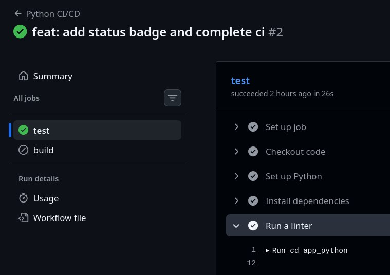
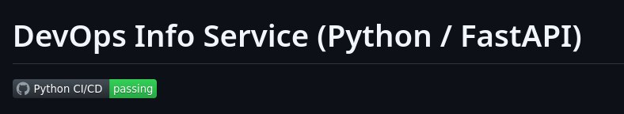

# Lab 3 — Continuous Integration (CI/CD)

## 1. Unit Testing

### Framework chosen

I chose `pytest` because of using plain `assert` statement instead of complex assertion methods. The framework has clear output with `-v` flag showing exactly what passed/failed. `pytest` is well-documented with many tutorials and examples.

### Test Structure

**Test Coverage:**

1. `test_root_endpoint()` - Tests `GET /` endpoint

2. `test_health_endpoint()` - Tests `GET /health` endpoint 

3. `test_404_error` - Tests error handling

Each test is independent. Tests use FastAPI's `TestClient` (no live server needed).

### How to Run Tests Locally

```bash
cd app_python
pip install -r requirements.txt
pytest tests/test_app.py -v
```

### Terminal Output Showing All Tests Passing

```bash
=================================================================== test session starts ====================================================================
platform linux -- Python 3.14.2, pytest-8.0.0, pluggy-1.6.0
rootdir: /home/flowelx/DevOps-Core-Course/app_python
plugins: anyio-4.12.1
collected 3 items                                                                                                                                          

tests/test_app.py ...                                                                                                                                [100%]

===================================================================== warnings summary =====================================================================
venv/lib/python3.14/site-packages/starlette/_utils.py:40
venv/lib/python3.14/site-packages/starlette/_utils.py:40
venv/lib/python3.14/site-packages/starlette/_utils.py:40
venv/lib/python3.14/site-packages/starlette/_utils.py:40
venv/lib/python3.14/site-packages/starlette/_utils.py:40
venv/lib/python3.14/site-packages/starlette/_utils.py:40
venv/lib/python3.14/site-packages/starlette/_utils.py:40
venv/lib/python3.14/site-packages/starlette/_utils.py:40
tests/test_app.py::test_404_error
  /home/flowelx/DevOps-Core-Course/app_python/venv/lib/python3.14/site-packages/starlette/_utils.py:40: DeprecationWarning: 'asyncio.iscoroutinefunction' is deprecated and slated for removal in Python 3.16; use inspect.iscoroutinefunction() instead
    return asyncio.iscoroutinefunction(obj) or (callable(obj) and asyncio.iscoroutinefunction(obj.__call__))

venv/lib/python3.14/site-packages/fastapi/routing.py:233
venv/lib/python3.14/site-packages/fastapi/routing.py:233
  /home/flowelx/DevOps-Core-Course/app_python/venv/lib/python3.14/site-packages/fastapi/routing.py:233: DeprecationWarning: 'asyncio.iscoroutinefunction' is deprecated and slated for removal in Python 3.16; use inspect.iscoroutinefunction() instead
    is_coroutine = asyncio.iscoroutinefunction(dependant.call)

-- Docs: https://docs.pytest.org/en/stable/how-to/capture-warnings.html
============================================================== 3 passed, 11 warnings in 0.27s ==============================================================
```

## 2. GitHub Actions CI Workflow

### Workflow Trigger Strategy

**Configuration:**

```yaml
on:
  push:
    branches: [ main, lab03 ]
  pull_request:
    branches: [ main ]
```

CI runs on feature branch and main. It saves GitHub Actions minutes, focused on importnant branches.
Docker build only runs on push to `main`. This prevents unnecessary Docker builds for every commit. 

### Marketplace Actions Chosen

1. `actions/checkout@v4` - Official GitHub action, reliable, well-maintained

2. `actions/setup-python@v5` - Handles multiple Python versions, caching built-in

3. `docker/login-action@v3` - Secure token-based login, handles credentials properly

4. `docker/build-push-action@v5` - Single action for both operations, supports caching

### Docker Tagging Strategy

**Strategy:** Calendar Versioning

**Format:** `YYYY.NN.DD`

It is convinient for frequent updates. There is no need to track breaking changes.

### Successful Workflow Run

**Link to Workflow Run:** https://github.com/flowelx/DevOps-Core-Course/actions/runs/21786077651/job/62857660802

**Screenshot of Green Checkmark:**



## CI Best Practices & Security

### Status Badge in README



### Caching Implementation

**Python Package Caching:**

```yaml
- uses: actions/setup-python@v5
  with:
    cache: 'pip'
    cache-dependency-path: 'app_python/requirements.txt'
```

### CI Best Practices Applied

1. Path-based Triggers

```yaml
paths:
  - 'app_python/**'
  - '.github/workflows/python-ci.yml'
```

2. **Job Dependencies**

```yaml
build:
  needs: test
```

3. **Conditional Execution**

```yaml
if: github.event_name == 'push' && github.ref == 'refs/heads/main'
```

4. **Security Scanning**

```yaml
- name: Security scan with pip-audit
  run: |
    cd app_python
    pip install pip-audit
    pip-audit -r requirements.txt || echo "Security scan completed"
```

5. **Linting**

```yaml
- name: Run linter
  run: |
    cd app_python
    flake8 app.py
```

6. **Test Reporting**

```yaml
pytest tests/test_app.py
```

### Security Scanning Results

**Tool Used:** `pip-audit`

I couldn't use Snyk because the site did not open with or without vpn. So I applied `pip-audit`.

**Scan Results:**

```
Found 2 known vulnerabilities in 1 package
Name      Version ID             Fix Versions
--------- ------- -------------- ------------
starlette 0.38.6  CVE-2024-47874 0.40.0
starlette 0.38.6  CVE-2025-54121 0.47.2
```
