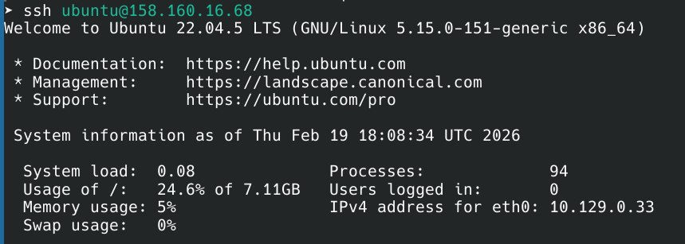

# Lab 4 — Infrastructure as Code (Terraform & Pulumi)

## Task 1 — Terraform VM Creation

### Cloud Provider Selection

I chose **Yandex Cloud** for this lab because it's accessible in Russia without VPN issues and offers a generous free tier.

### Terraform Version Used

```bash
terraform version
Terraform v1.14.3
on linux_amd64
```

### Resources Created

| Resource | Configuration |
|----------|--------------|
| **VM Name** | `terraform-vm` |
| **Zone** | `ru-central1-b` |
| **CPU** | 2 cores |
| **RAM** | 4 GB |
| **Boot Disk** | 20 GB |
| **OS Image** | Ubuntu |
| **Network** | Existing VPC (`default`) |
| **Public IP** | Enabled |

### SSH Connection Command

```bash
ssh ubunutu@IP
```

### Terminal output

```bash
terraform plan
Plan: 2 to add, 0 to change, 0 to destroy.
```

```bash
terraform apply --auto-approve
yandex_vpc_security_group.vm-sg: Creation complete
yandex_compute_instance.vm: Creation complete

Outputs:
external_ip = "158.160.16.68"
ssh_command = "ssh ubuntu@158.160.16.68"
```

### Proof of SSH Access to VM



## Task 2 — Pulumi VM Creation

### Cleanup Terraform

```bash
terraform destroy -auto-approve
Destroy complete! Resources: 2 destroyed.
```

### Pulumi Setup

- Language: Python
- Version: v3.130.0

### Execution Logs

**pulumi preview:**

```bash
pulumi preview
+ yandex:vpc:securityGroup vm-sg create
+ yandex:compute:instance pulumi-vm create
```

**pulumi up:**

```bash
pulumi up --yes
Outputs:
external_ip : "158.160.16.69"
ssh_command : "ssh ubuntu@158.160.16.69"
```

## Task 3 — Comparison

### Terraform vs Pulumi

|Aspect | Terraform | Pulumi (Python)|
|---|---|---|
|**Ease of Learning** | Simpler HCL syntax | Requires Python knowledge|
|**Readability** | Clear, declarative | Mixed with Python code|
|**Flexibility** | Limited | Full Python|
|**Debugging** | Clear error messages | Python stack traces|
|**State** | Local tfstate file | Pulumi Cloud|

**My Preference:** Terraform 
