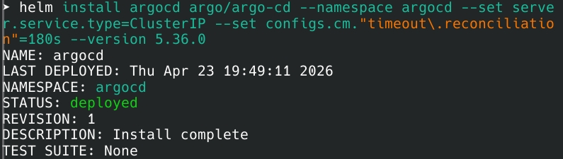
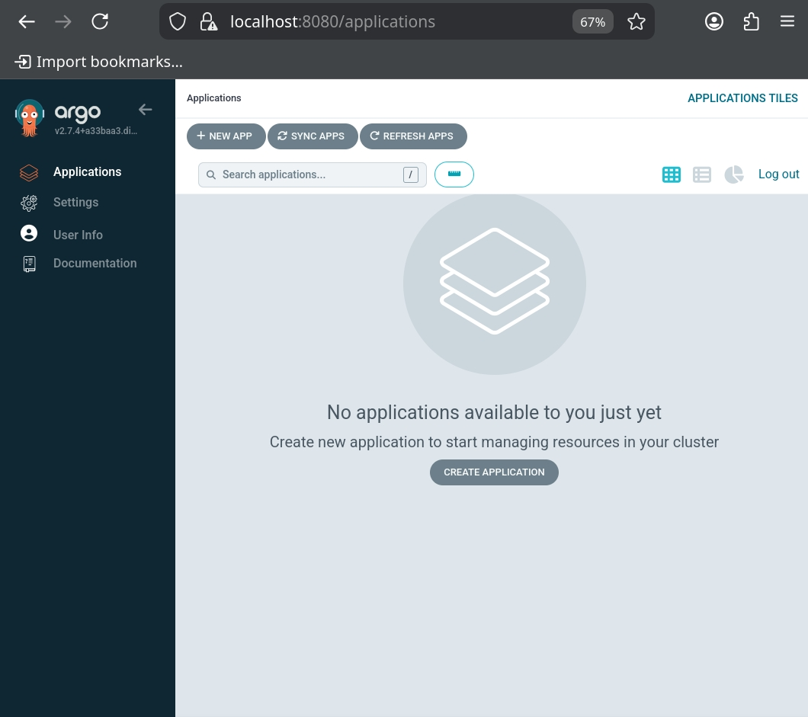
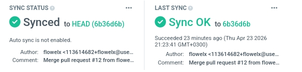

# Lab 13 — GitOps with ArgoCD

## 1. ArgoCD Setup

**Installation Verification:** All 7 ArgoCD pods are running in `argocd` namespace including controller, server, and repo-server.

**UI Access:** Port-forward to `https://localhost:8080` using `kubectl port-forward svc/argocd-server -n argocd 8080:443`. Login with `admin` and password retrieved from `argocd-initial-admin-secret`.

**CLI:** Installed and configured using `argocd login localhost:8080 --insecure`.

---

## 2. Application Configuration

**Repository:** `https://github.com/flowelx/DevOps-Core-Course.git` (branch: HEAD, path: `mychart`)

**Destination:** Kubernetes cluster `https://kubernetes.default.svc`

**Values Files:** `environments/values-dev.yaml` for dev, `environments/values-prod.yaml` for prod

**Manifests:** `k8s/argocd/application-dev.yaml` and `application-prod.yaml`

---

## 3. Multi-Environment Configuration

| Setting | Dev | Prod |
|---------|-----|------|
| Replicas | 1 | 3 |
| Image tag | dev | stable |
| CPU/Memory | 100m/128Mi | 500m/512Mi |
| APP_MODE | development | production |
| HPA | Disabled | Enabled (3-10) |
| Namespace | dev | prod |

**Sync Policy:** Dev uses **auto-sync** with `selfHeal: true` and `prune: true` for fast iteration. Prod uses **manual sync** only to enforce change control, approval gates, and maintenance windows — a best practice for production environments.

---

## 4. Self-Healing Evidence

**Test 1 — Manual Scale:** Scaled deployment to 5 replicas using `kubectl scale`. ArgoCD detected drift within 3 minutes and reverted back to 1 replica.

**Test 2 — Pod Deletion:** Deleted a pod using `kubectl delete pod`. Kubernetes ReplicaSet recreated it within 5 seconds. This is Kubernetes native self-healing, not ArgoCD.

**Test 3 — Configuration Drift:** Added a manual label to the deployment. ArgoCD diff showed the addition, and self-heal removed the label automatically within 3 minutes.

**Key Distinction:** Kubernetes maintains pod availability (restarts failed pods). ArgoCD maintains configuration correctness (reverts manual changes to match Git).

