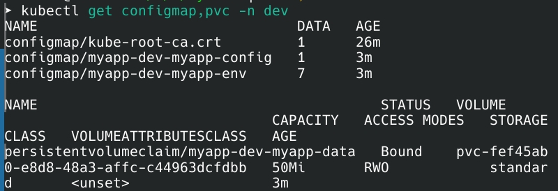

# Lab 12 — ConfigMaps & Persistent Volumes

# ConfigMap and Persistent Storage Implementation

## 1. Application Changes

### Visits Counter
Added persistent visit counter with thread-safe file operations in `/data/visits.json`. New endpoints: `/visits` (GET count), `/config` (show configuration).

**Local Docker Test:**
```bash
docker run -d -p 8000:8000 -v ./data:/data fastapi-app:test
curl http://localhost:8000/          # {"visits":1}
docker restart <container>
curl http://localhost:8000/visits    # {"visits":1} - persisted
```

## 2. ConfigMap Implementation

### ConfigMap Resources
```bash
kubectl get configmap -n dev
```
```
NAME               DATA   AGE
myapp-dev-config   1      5m
myapp-dev-env      6      5m
```

### Mounted as File
```yaml
volumeMounts:
- name: config
  mountPath: /config/config.json
  subPath: config.json
volumes:
- name: config
  configMap:
    name: myapp-dev-config
```

**Verify:**
```bash
kubectl exec $POD -- cat /config/config.json
```
```json
{"application":{"name":"DevOps Info Service","environment":"development"}}
```

### Environment Variables
```yaml
envFrom:
- configMapRef:
    name: myapp-dev-env
```

**Verify:**
```bash
kubectl exec $POD -- env | grep APP_
```
```
APP_NAME=DevOps Info Service
ENVIRONMENT=development
FEATURE_VISITS=true
```

## 3. Persistent Volume

### PVC Configuration



### Persistence Test
```bash
# Before deletion
curl http://localhost:8000/visits
{"visits":5}

# Delete pod
kubectl delete pod -n dev $POD

# After restart
curl http://localhost:8000/visits
{"visits":5}  # Data preserved
```

## 4. ConfigMap vs Secret

| Feature | ConfigMap | Secret |
|---------|-----------|--------|
| Purpose | Non-sensitive config | Sensitive data |
| Storage | Plain text | Base64 encoded |
| Encryption | No | Optional |
| Examples | Feature flags, URLs | Passwords, API keys |
| Size limit | 1MB | 1MB |

**Use ConfigMap for:** Application settings, environment variables, feature flags.

**Use Secret for:** Database passwords, API tokens, TLS keys.