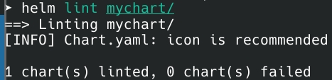
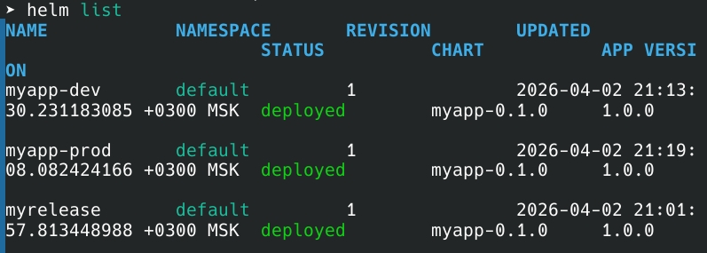

# Lab 10 — Helm Package Manager

## 1. Chart Overview

The chart is located in `k8s/mychart/` and follows standard Helm v3 structure:

```
mychart/
├── Chart.yaml
├── values.yaml
├── environments/
│   ├── values-dev.yaml
│   └── values-prod.yaml
└── templates/
    ├── _helpers.tpl
    ├── deployment.yaml
    ├── service.yaml
    ├── hpa.yaml
    └── *-hook.yaml
```

**Key files:**
- `deployment.yaml` – main application deployment with probes, resources, and env vars
- `service.yaml` – service definition (ClusterIP/NodePort/LoadBalancer)
- `hpa.yaml` – autoscaling (prod only)
- `_helpers.tpl` – reusable labels and naming functions

**Values strategy:** Defaults in `values.yaml`, environment overrides in `environments/` (dev/prod).

---

## 2. Configuration Guide

### Important values

| Value | Purpose |
|-------|---------|
| `replicaCount` | Number of pods |
| `image.repository/tag` | Container image |
| `service.type` | ClusterIP/NodePort/LoadBalancer |
| `resources` | CPU/memory limits |
| `livenessProbe/readinessProbe` | Health checks |
| `autoscaling` | HPA configuration |

### Environment differences

| Setting | Dev | Prod |
|---------|-----|------|
| Replicas | 1 | 3 |
| Service type | NodePort | LoadBalancer |
| CPU limit | 200m | 1000m |
| Memory limit | 256Mi | 1Gi |
| HPA | disabled | enabled |
| Log level | debug | info |

### Installation examples

```bash
# Dev
helm install myapp-dev ./mychart -f ./mychart/environments/values-dev.yaml

# Prod
helm install myapp-prod ./mychart -f ./mychart/environments/values-prod.yaml
```

---

## 3. Hook Implementation

Two hooks are implemented with proper weights and deletion policies:

| Hook | Weight | Purpose |
|------|--------|---------|
| Pre-install | -5 | Pre-flight checks, validation |
| Post-install | 5 | Smoke tests after deployment |

---

## 4. Installation Evidence

### Helm releases



### Deployed resources



## 5. Operations

| Operation | Command |
|-----------|---------|
| Install | `helm install <name> ./mychart -f <values-file>` |
| Upgrade | `helm upgrade <name> ./mychart -f <values-file>` |
| Rollback | `helm rollback <name> <revision>` |
| Uninstall | `helm uninstall <name>` |
| List releases | `helm list` |
| Release history | `helm history <name>` |
