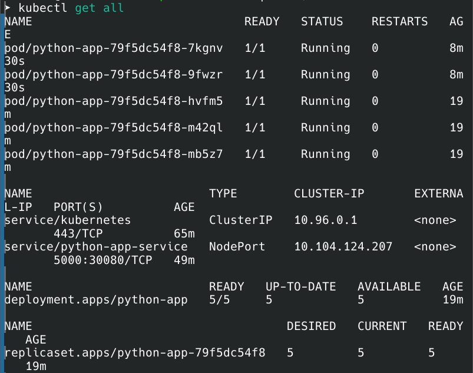
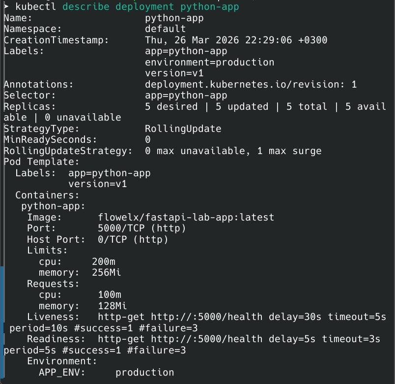
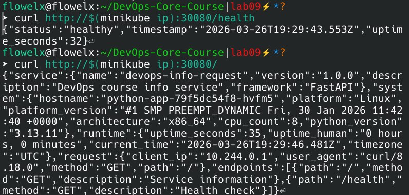

# Lab 9 — Kubernetes Fundamentals

## Architecture Overview

### Deployment Architecture

My Kubernetes implementation consists of a three-tier architecture for a Python web application with the following components:

**Control Plane (Minikube):**
- Single node cluster running all control plane components
- API Server, Scheduler, Controller Manager, etcd

**Application Layer:**
- **Deployment**: `python-app` managing 5 pod replicas
- **Pods**: Each running a Python web server on port 5000
- **Labels**: Organized with `app=python-app`, `environment=production`

**Networking Layer:**
- **Service**: NodePort type (`python-app-service`)
- **Traffic Flow**: External → NodePort (30080) → Service (5000) → Pod (5000)
- **Load Balancing**: Service distributes traffic across all 5 replicas

### Resource Allocation Strategy

| Component | CPU Request | CPU Limit | Memory Request | Memory Limit |
|-----------|------------|-----------|----------------|--------------|
| Each Pod | 100m (0.1 core) | 200m (0.2 core) | 128Mi | 256Mi |
| **Total Cluster** | 500m | 1000m | 640Mi | 1280Mi |

**Rationale**: Requests ensure each pod gets minimum resources; limits prevent resource starvation. Conservative limits chosen for local development with room for scaling.

## Manifest Files

### 1. `deployment.yml`
Manages application lifecycle with production best practices:

```yaml
replicas: 5
strategy: RollingUpdate
  maxSurge: 1
  maxUnavailable: 0
```

**Why 5 replicas?** Provides fault tolerance (can lose up to 2 pods) and handles moderate traffic spikes in development.

**Health Probes:**
- **Liveness**: `/health` endpoint checked every 10 seconds, starts after 30 seconds
- **Readiness**: Same endpoint checked every 5 seconds, starts after 5 secondss

### 2. `service.yml`
Exposes application internally and externally:

```yaml
type: NodePort
selector: app=python-app
ports: 5000:30080
```

**Why NodePort?** Perfect for Minikube local development. Provides external access without cloud load balancers.

## Deployment Evidence

### Current Cluster State



### Deployment Details



### Application Verification



## Operations Performed

### 1. Initial Deployment
```bash
kubectl apply -f k8s/deployment.yml

kubectl apply -f k8s/service.yml
```

### 2. Scaling to 5 Replicas
```bash
kubectl scale deployment python-app --replicas=5

kubectl get pods -l app=python-app
```

### 3. Rolling Update Demonstration
```bash
kubectl set image flowelx/python-app python-app=myapp:v2

kubectl rollout status flowelx/python-app
```

### 4. Service Access Method
```bash
curl http://$(minikube ip):30080/health
```

## Production Considerations

### Health Checks Implementation

**Liveness Probe** (`/health` every 10s):
- Purpose: Detects if application is deadlocked or frozen
- Failure action: Kubernetes restarts the container
- Initial delay 30s gives app time to start before checking

**Readiness Probe** (`/health` every 5s):
- Purpose: Determines if pod can receive traffic
- Failure action: Removes pod from service endpoints
- Initial delay 5s ensures app starts accepting traffic quickly

Why separate probes? Liveness prevents zombies, readiness prevents traffic to unready pods. Combined they ensure both availability and reliability.

### Resource Limits Rationale

**Requests (128Mi CPU/100m CPU):**
- Guarantees minimum resources for stable operation
- Ensures Kubernetes schedules pods on nodes with available capacity

**Limits (256Mi CPU/200m CPU):**
- Prevents any single pod from consuming all node resources
- Protects cluster from noisy neighbor problems
- Conservative limits chosen based on local testing showing app uses ~100Mi RAM

### Production Improvements

1. **High Availability:**
   - Deploy to multiple availability zones
   - Use Horizontal Pod Autoscaler (HPA) for dynamic scaling
   - Implement Pod Disruption Budgets (PDB) for maintenance

2. **Security:**
   - Use private image registry with image pull secrets
   - Implement Network Policies for pod-to-pod communication
   - Enable Pod Security Standards (PSS) for pod isolation

3. **Observability:**
   - Deploy Prometheus for metrics collection
   - Add Grafana for visualization
   - Implement structured logging with Loki/ELK stack
   - Add distributed tracing with Jaeger

4. **Configuration Management:**
   - Use ConfigMaps for non-sensitive configuration
   - Use Secrets for sensitive data (database passwords, API keys)
   - Consider Helm charts for complex deployments

### Monitoring Strategy

Current implementation includes:
- **Readiness/Liveness probes**: Basic health monitoring
- **Metrics endpoint**: `/metrics` exposed for Prometheus scraping
- **Resource monitoring**: Kubernetes native metrics via `kubectl top`

Production monitoring would add:
- **Prometheus**: Scrape metrics every 15s with alert rules
- **Grafana**: Dashboards for CPU, memory, request rates, error rates
- **AlertManager**: Alert on high error rates, pod restarts, resource pressure
- **Log aggregation**: Centralized logging with correlation IDs

## Challenges & Solutions

### CrashLoopBackOff Due to Port Mismatch

**Problem:** Pods kept crashing with logs showing:
```
Uvicorn running on http://0.0.0.0:5000
INFO:     Shutting down
```

The application started successfully but immediately shut down because liveness probes were checking port 8000 instead of 5000.

**Debugging Process:**
1  Checked pod logs: `kubectl logs python-app-xxx`
2. Verified app was listening on port 5000
3. Checked deployment configuration: `kubectl describe pod python-app-xxx`
4. Discovered port mismatch between containerPort (8000) and actual app port (5000)

**Solution:**
Updated deployment.yml to use port 5000 in:
- `containerPort`
- `livenessProbe.port`
- `readinessProbe.port`
- Service targetPort

**Lesson Learned:** Always verify the actual port your application listens on and ensure consistency across container ports, probes, and service configurations.