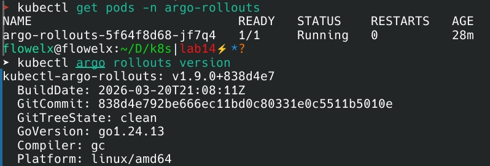

# Lab 14 — Progressive Delivery with Argo Rollouts

## 1. Setup

### Verification
```bash
kubectl get pods -n argo-rollouts
kubectl argo rollouts version
```



### Dashboard
```bash
kubectl argo rollouts dashboard --port 3100
```

---

## 2. Canary Deployment

### Configuration
```yaml
steps:
- setWeight: 20
- pause: {} 
- setWeight: 40
- pause: {duration: 30s}
- setWeight: 60
- pause: {duration: 30s}
- setWeight: 80
- pause: {duration: 30s}
- setWeight: 100
```

### Commands
```bash
kubectl argo rollouts set image myapp myapp=nginx:alpine
kubectl argo rollouts promote myapp
kubectl argo rollouts abort myapp
kubectl argo rollouts get rollout myapp --watch
```

---

## 3. Blue-Green Deployment

### Configuration
```yaml
blueGreen:
  activeService: myapp-active
  previewService: myapp-preview
  autoPromotionEnabled: false
  scaleDownDelaySeconds: 30
```

### Commands
```bash
kubectl port-forward svc/myapp-preview 8080:80
curl http://localhost:8080
kubectl argo rollouts promote myapp-bluegreen
kubectl argo rollouts undo myapp-bluegreen
```

---

## 4. Strategy Comparison

| Aspect | Canary | Blue-Green |
|--------|--------|------------|
| Traffic shift | Gradual | Instant |
| Rollback speed | 2-3 min | 1-2 sec |
| Resources | Low | 2x |
| Production testing | Yes | No |

### When to use

**Canary:** Mission-critical, high-traffic, need metrics validation

**Blue-Green:** Batch processing, internal tools, fast rollback needed

---

## 5. Useful Commands

```bash
kubectl argo rollouts list
kubectl describe rollout <NAME>
kubectl argo rollouts history <NAME>
kubectl argo rollouts restart <NAME>
kubectl argo rollouts retry <NAME>
kubectl logs -n argo-rollouts deployment/argo-rollouts --tail=50
```