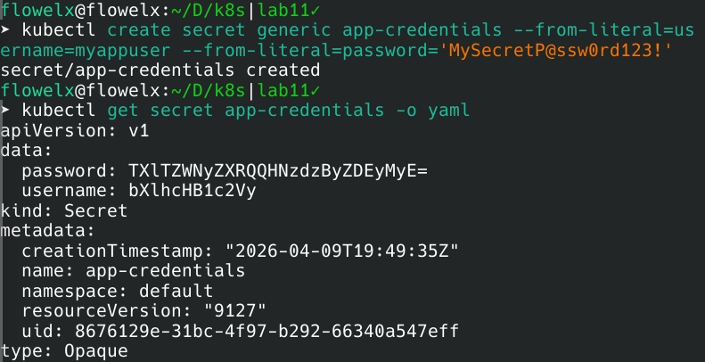
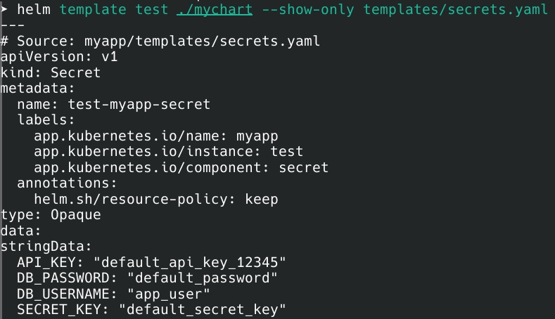

# SECRETS.md

## 1. Kubernetes Secrets

### Creation & Viewing



$ kubectl get secret app-credentials -o yaml
```
```yaml
data:
  username: bXlhcHB1c2Vy
  password: TXlTZWNyZXRQQHNzdzByZDEyMyE=
```

### Encoding vs Encryption
- **Base64 = Encoding**: Easily reversible, no security
- **Encryption**: Requires key, provides confidentiality
- **Default**: K8s secrets stored as plain base64 in etcd (NOT encrypted)

---

## 2. Helm Integration

### Structure
```
mychart/
├── templates/
│   ├── secrets.yaml
│   └── deployment.yaml
└── values.yaml
```

### Secret Template (`secrets.yaml`)
```yaml
{{- if .Values.secrets.enabled }}
apiVersion: v1
kind: Secret
metadata:
  name: {{ include "myapp.fullname" . }}-secret
stringData:
  DB_USERNAME: {{ .Values.secrets.stringData.DB_USERNAME | quote }}
  DB_PASSWORD: {{ .Values.secrets.stringData.DB_PASSWORD | quote }}
{{- end }}
```

### Consumption (`deployment.yaml`)
```yaml
containers:
  - name: {{ .Chart.Name }}
    envFrom:
      - secretRef:
          name: {{ include "myapp.fullname" . }}-secret
```



---

## 3. Resource Limits

### Configuration
```yaml
resources:
  limits:
    cpu: 500m
    memory: 512Mi
  requests:
    cpu: 250m
    memory: 256Mi
```

### Requests vs Limits
- **Requests**: Minimum guaranteed (scheduling)
- **Limits**: Maximum allowed (throttling)

### Guidelines
1. Observe actual usage: `kubectl top pods`
2. Set requests to ~50-70% of average
3. Set limits to ~2-3x requests for bursts

---

## 4. Vault Integration

### Installation
```bash
$ kubectl get pods -n vault
NAME    READY   STATUS    RESTARTS   AGE
vault   1/1     Running   0          10m
```
Vault server deployed (manual manifest due to Helm repo 403 error)

### Issue Encountered
- **Helm repo 403 error**: HashiCorp repository inaccessible
- **Workaround**: Manual manifest deployment
- **Remaining**: Injector webhook, end-to-end verification

---

## 5. Security Comparison

| Feature | K8s Secrets | HashiCorp Vault |
|---------|-------------|-----------------|
| Encryption at rest | (unless configured) | Default |
| Dynamic secrets | no | yes |
| Automatic rotation | no | yes |
| Audit logging | Basic | Comprehensive |
| Complexity | Low | High |

### When to Use

**K8s Secrets:**
- Dev/test environments
- Simple static credentials
- No compliance requirements

**Vault:**
- Production workloads
- Regulatory compliance (PCI, HIPAA)
- Multi-cluster setups
- Dynamic credentials needed

### Production Recommendations
1. Enable etcd encryption for K8s secrets
2. Use External Secrets Operator for hybrid approach
3. Implement RBAC restrictions
4. Rotate secrets every 30-90 days
5. Enable audit logging
