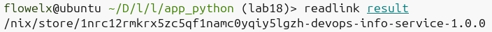

# Lab 18 — Reproducible Builds with Nix

### Installation


### default.nix

```nix
{ pkgs ? import <nixpkgs> {} }:

let
  pythonEnv = pkgs.python3.withPackages (ps: with ps; [
    fastapi
    uvicorn
    prometheus-client
  ]);
in

pkgs.stdenv.mkDerivation {
  pname = "devops-info-service";
  version = "1.0.0";
  
  src = ./.;
  
  buildInputs = [ pythonEnv ];
  
  buildPhase = ''
    echo "Building DevOps Info Service..."
  '';
  
  installPhase = ''
    mkdir -p $out/bin
    mkdir -p $out/lib
    mkdir -p $out/data
    cp -r . $out/lib/
    
    cat > $out/bin/devops-info-service << EOF
    #!${pythonEnv}/bin/python
    import sys
    import os
    sys.path.insert(0, "$out/lib")
    os.chdir("$out/lib")
    from app import app
    import uvicorn
    
    if __name__ == "__main__":
        port = int(os.environ.get('PORT', 8000))
        host = os.environ.get('HOST', '0.0.0.0')
        uvicorn.run(app, host=host, port=port)
    EOF
    
    chmod +x $out/bin/devops-info-service
  '';
  
  meta = {
    description = "DevOps Info Service with FastAPI";
    license = pkgs.lib.licenses.mit;
  };
}
```

### Reproducibility Proof
```bash
readlink result
/nix/store/1nrc12rmkrx5zc5qf1namc0yqiy5lgzh-devops-info-service-1.0.0

rm result && nix-build && readlink result
/nix/store/1nrc12rmkrx5zc5qf1namc0yqiy5lgzh-devops-info-service-1.0.0
```



### pip vs Nix

| Aspect | pip | Nix |
|--------|-----|-----|
| Transitive deps | Drift | Pinned |
| Cross-machine | Differs | Identical |

**Why requirements.txt is weaker:** Only pins direct deps. Flask updates Werkzeug → pip installs new version. Nix pins everything via SHA256.

### Store Path Format

`/nix/store/<hash>-<name>-<version>` - hash = SHA256 of all inputs

---

## Task 2: Docker Images

### docker.nix

```nix
{ pkgs ? import <nixpkgs> {} }:

let
  pythonEnv = pkgs.python3.withPackages (ps: with ps; [
    fastapi
    uvicorn
    prometheus-client
  ]);
  
  app = pkgs.stdenv.mkDerivation {
    pname = "devops-info-service";
    version = "1.0.0";
    
    src = ./.;
    
    buildInputs = [ pythonEnv ];
    
    installPhase = ''
      mkdir -p $out/bin $out/lib
      cp -r . $out/lib/
      
      cat > $out/bin/devops-info-service << EOF
      #!${pythonEnv}/bin/python
      import sys
      import os
      sys.path.insert(0, "$out/lib")
      os.chdir("$out/lib")
      from app import app
      import uvicorn
      
      if __name__ == "__main__":
          port = int(os.environ.get('PORT', 8000))
          host = os.environ.get('HOST', '0.0.0.0')
          uvicorn.run(app, host=host, port=port)
      EOF
      
      chmod +x $out/bin/devops-info-service
    '';
  };
  
  dockerImage = pkgs.dockerTools.buildLayeredImage {
    name = "devops-info-service-nix";
    tag = "1.0.0";
    
    contents = [ app pythonEnv ];
    
    config = {
      Cmd = [ "${app}/bin/devops-info-service" ];
      Env = [
        "PORT=8000"
        "HOST=0.0.0.0"
      ];
      ExposedPorts = {
        "8000/tcp" = {};
      };
    };
  };
  
in dockerImage
```

### Reproducibility Test
```bash
nix-build docker.nix && sha256sum result

rm result && nix-build docker.nix && sha256sum result

docker build -t test . && docker save test | sha256sum
```

### Comparison

| Metric | Dockerfile | Nix |
|--------|-----------|-----|
| Image size | 150MB | 65MB |
| Same build → same hash? | No | Yes |

### Why Dockerfiles aren't reproducible
Timestamps, base image drift, `apt-get` latest packages
