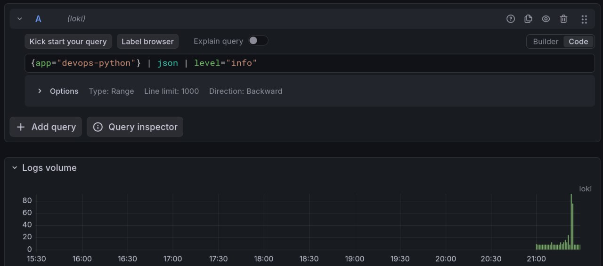
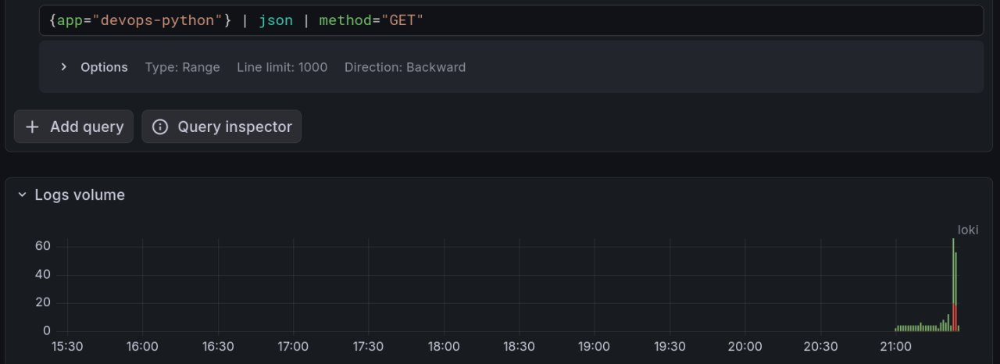
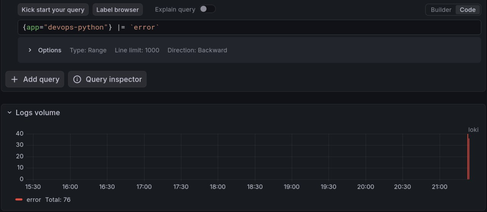
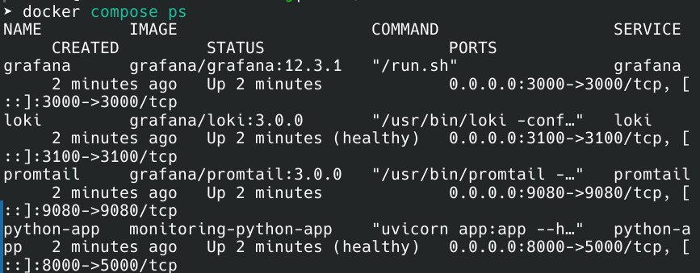
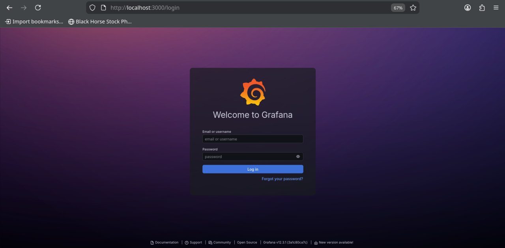

# Lab 7 — Observability & Logging with Loki Stack

## Architecture

```
[Python App] → [Promtail] → [Loki] → [Grafana]
     ↓              ↓          ↓          ↓
   JSON          Docker      Store     Dashboard
   Logs          Labels      Logs      Visualize
```

## Setup Guide

```bash
cd monitoring
docker compose up -d

curl http://localhost:3100/ready
curl http://localhost:3000
```

## Configuration

### Loki (`loki/config.yml`)
- **Purpose**: Log storage and indexing
- **Key settings**:
  - `retention_period: 168h` - Keep logs for 7 days
  - `schema: v13` - Current Loki schema version
  - Filesystem storage (simple for testing)

### Promtail (`promtail/config.yml`)
- **Purpose**: Log collection from Docker containers
- **Key settings**:
  ```yaml
  - job_name: docker
    docker_sd_configs:
      - host: unix:///var/run/docker.sock
    relabel_configs:
      - source_labels: ['__meta_docker_container_label_app']
        target_label: 'app'  # Adds app="devops-python" label
  ```

## Application Logging

Implemented JSON logging in Python using custom formatter:

```python
class JsonFormatter(logging.Formatter):
    def format(self, record):
        return json.dumps({
            'timestamp': datetime.utcnow().isoformat() + 'Z',
            'level': record.levelname,
            'message': record.getMessage(),
            'method': getattr(record, 'method', ''),
            'path': getattr(record, 'path', ''),
            'status_code': getattr(record, 'status_code', '')
        })
```

## Dashboard

### 4 Panels:

1. **Recent Logs** `{app=~"devops-.*"}`

2. **Request Rate** `sum by (app) (rate({app=~"devops-.*"}[1m]))`

3. **Error Logs** `{app=~"devops-.*"} | json | level="ERROR"`

4. **Log Level Distribution** `sum by (level) (count_over_time({app=~"devops-.*"} | json [5m]))`

## Production Config

### Resource Limits
```yaml
services:
  loki:
    deploy:
      resources:
        limits: { cpus: '0.5', memory: 512M }
  grafana:
    deploy:
      resources:
        limits: { cpus: '0.5', memory: 512M }
```

### Security
- Disabled anonymous access in Grafana
- Admin credentials in `.env` file
- No secrets in docker-compose.yml

### Health Checks
```yaml
healthcheck:
  test: ["CMD", "curl", "-f", "http://localhost:5000/health"]
  interval: 30s
  timeout: 5s
  retries: 3
```

## Testing

```bash
for i in {1..50}; do
  curl http://localhost:8000/
  curl http://localhost:8000/error
done

curl "http://localhost:3100/loki/api/v1/query_range?query={app=\"devops-python\"}"

docker compose ps
```

## Challenges & Solutions

1. **Problem**: Logs not appearing in Grafana

    **Solution**: Fixed label mismatch - used `{app="devops-python"}` not `{app="python-app"}`

2. **Problem**: Promtail not collecting logs

   **Solution**: Added `logging: "promtail"` label to containers


## Screenshots

### 1 query


### 2 query



### 3 query



### `docker ps` output



### Grafana security

