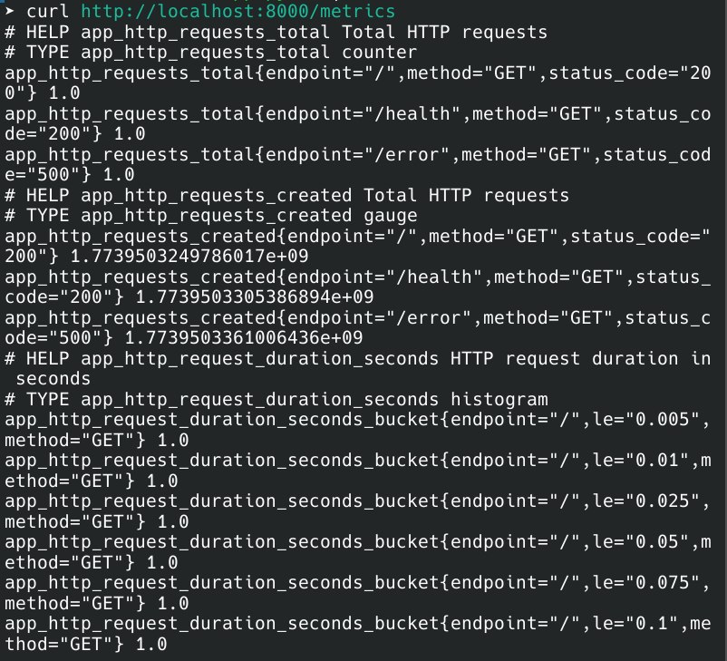
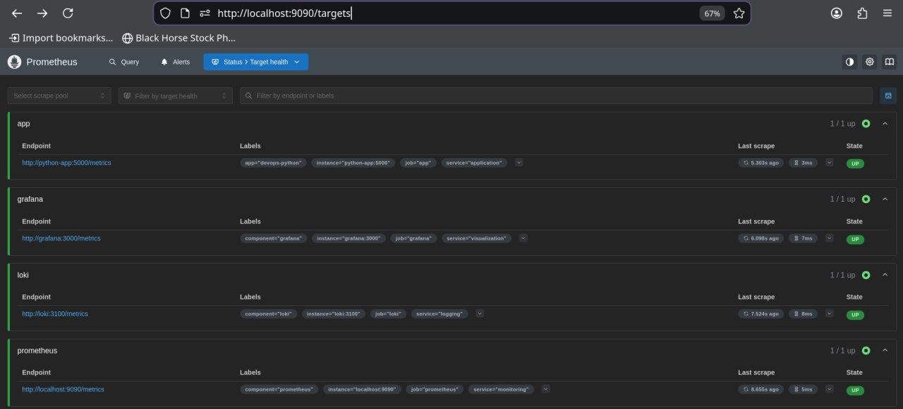
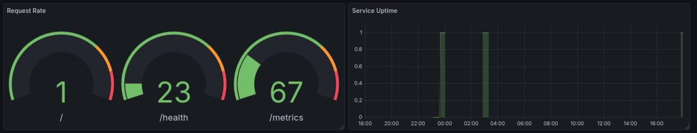

# Lab 8 — Metrics & Monitoring with Prometheus

Understood! Let me create a simplified report based on your actual metrics.

# LAB 08: Application Monitoring with Prometheus and Grafana

## 1. Architecture

```
Python App (FastAPI) → Prometheus (scrape /metrics) → Grafana (visualization)
      :5000                  :9090                         :3000
         ↓                      ↓                             ↓
   Exposes metrics       Stores time-series          Dashboards with PromQL
```

All services run in Docker containers on `logging-network`.





## 2. Application Metrics

Currently exposed metrics from `/metrics` endpoint:

| Metric | Type | Labels | Purpose |
|--------|------|--------|---------|
| `app_http_requests_total` | Time series | method, endpoint, status_code | Track all HTTP requests |
| `up` | Gauge | job, instance | Service health indicator |


## 3. Prometheus Configuration

```yaml
global:
  scrape_interval: 15s

scrape_configs:
  - job_name: 'prometheus'
    static_configs: [{targets: ['localhost:9090']}]
  
  - job_name: 'app'
    static_configs: [{targets: ['python-app:5000']}]
    metrics_path: /metrics
```

## 4. Dashboard Panels (Based on Available Metrics)

### Panel 1: Total Requests Counter
```promql
sum(app_http_requests_total) by (endpoint)
```
**Type:** Stat / Bar Gauge  
Shows total requests per endpoint.

### Panel 2: Request Rate
```promql
sum(rate(app_http_requests_total[5m])) by (endpoint)
```
**Type:** Graph  
Shows requests per second by endpoint.

### Panel 3: Requests by Status Code
```promql
sum by (status_code) (rate(app_http_requests_total[5m]))
```
**Type:** Pie Chart  
Distribution of 2xx, 4xx, 5xx responses.

### Panel 4: Service Uptime
```promql
up{job="app"}
```
**Type:** Stat  
Shows if application is UP (1) or DOWN (0).

### Panel 5: Top Endpoints
```promql
topk(5, sum(app_http_requests_total) by (endpoint))
```
**Type:** Bar Gauge  
Top 5 most accessed endpoints.

### Panel 6: Status Code Trends
```promql
sum by (status_code) (rate(app_http_requests_total[5m]))
```
**Type:** Graph  
Shows trends of different status codes over time.

## 5. PromQL Examples

```promql
# 1. Total requests count
sum(app_http_requests_total)

# 2. Requests per second (rate)
rate(app_http_requests_total[5m])

# 3. Requests per endpoint
sum(app_http_requests_total) by (endpoint)

# 4. Error count (5xx)
sum(app_http_requests_total{status_code=~"5.."})

# 5. Service health
up{job="app"}

# 6. Success rate (2xx)
sum(rate(app_http_requests_total{status_code=~"2.."}[5m])) / sum(rate(app_http_requests_total[5m])) * 100
```

## 6. Production Setup

**Health Checks:**
```yaml
prometheus:
  healthcheck: {test: ["CMD", "wget", "http://localhost:9090/-/healthy"]}
python-app:
  healthcheck: {test: ["CMD", "curl", "-f", "http://localhost:5000/health"]}
```

**Resource Limits:**
- python-app: 256MB memory, 0.3 CPU
- prometheus: 512MB memory, 0.5 CPU

## 7. Testing Results



## 8. Challenges & Solutions

| Challenge | Solution |
|-----------|----------|
| `/metrics` returning 404 in Docker | Rebuilt with `--no-cache` to update code |
| Wrong port configuration | Used `python-app:5000` (internal container port) |
| No metrics data in Grafana | Generated test traffic to populate metrics |
| Duplicate metrics error | Cleared registry on startup |

## 9. Metrics vs Logs

| Aspect | Metrics (Prometheus) | Logs (Loki) |
|--------|---------------------|-------------|
| **What** | Counters, gauges (numbers) | Events, messages (text) |
| **Use Case** | Performance monitoring, alerts | Debugging, auditing |
| **Query** | "How many requests?" | "Why did it fail?" |
| **Storage** | Time-series efficient | Text storage |

**Use metrics** for trends, alerts, and capacity planning  
**Use logs** for debugging errors and investigating issues

## 10. Verification Commands

```bash
# Check all services
docker-compose ps

# Test metrics endpoint
curl http://localhost:8000/metrics

# Check Prometheus targets
curl http://localhost:9090/api/v1/targets

# Generate test traffic
for i in {1..50}; do 
    curl -s http://localhost:8000/ > /dev/null
    curl -s http://localhost:8000/health > /dev/null
    sleep 0.2
done
```